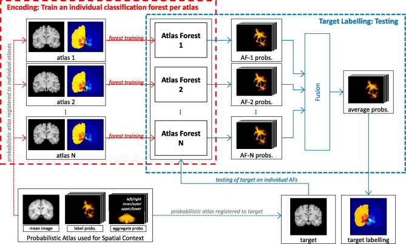

# Header

---------------------------

Find the following information about this article:

    Title: Encoding atlases by randomized classification forests for efficient multi-atlas label propagation
    Author: Zikic, Glocker and Criminisi
    Journal/Conference: MedIA
    Year: 2014

# Graphical Abstract

---------------------------

# Highlight

---------------------------

## Motivations

- One-to-one correspondences scheme is accurate but computationally expensive due to the need to be registered (non-linearly moreover) the target image to each atlas to perform multi-atlas based segmentation.
- Patch-based scheme is based on local similarity-based search and is fast due to the fact that the registration is based on a rigid model. However, this is difficult to fusion the answers.  

## Methods

- An atlas is composed of a patient acquisition with its corresponding manual labeling.
- A probabilistic atlas using the different atlas. Thus, an average intensity image, a set of label priors  and a set of location priors are generated.
- For the training, the probabilistic atlas is registered to an individual atlas. Then, the individual atlas in addition with the labels and location priors previously registered ared feeding a forest. No bagging strategy is used and a normalization using the frequency of each classes is performed to increase the influence of small classes.
- For testing, the probabilistic atlas is registered to the target image. Then, the target image in addition with the labels and location priors previously registered are used to feed the different forest trained. The final labeling is find by average of the different output of the different forests.
- Additionally, each forest could be train using auto-context. In this framework, successive classifiers are trained in a stacked manner. The features in entrance of each classifier are made of the original features concatenated with the ouput of the probabilistic output of the previous classifiers in the stack. For more information, take a look to the following article also review: Auto-context and its application to high-level vision tasks.

## Pros & Cons

- Only one deformable registration is needed during the test stage.
- A simple fusion scheme can be used to fusion the outputs of the different classifiers.
- Possibility to incrementally learn a new atlas. However, the probabilistic atlas have to be recomputed.
- Auto-context have been studied but the experiment have not been totally conclusive.

## Future Works 

- Not scale-invariant. 

# Discussions

---------------------------

- Even if it is advance by the authors that only one registration is needed, more complications can happen in case that a new atlas is provided. In this case, the probabilistic atlas have to be recomputed which is the major time consuming part of this paper. However, only an additional forest will have to be learned without touching the other forests.